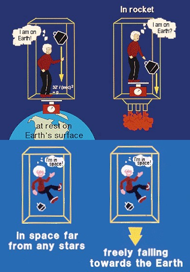

This post is about my thoughts on the nature of mass.

# The problem of physics

As many people know, the biggest problem of modern physics is that there 
are two powerfull theories, relativity and quantum mechanics, but that 
they are not yet able to merge together into a coherent and unified 
theory that explain both gravity and the microscopic world of particles.

Some of the symptoms of the disease of physics (the lack of a unified 
theory) can be seen in aspects such as the Lorentz factor, a mathematical 
expression that appears frequently in relativity:

$$
\frac{1}{\sqrt{1 - \frac{v^2}{c^2}}},
$$

where $v$ is the velocity of a given object and $c$ is the speed of light.

This factor appears in the denominator of equations such as that of 
relativistic momentum:

$$
p = \frac{m_0 v}{\sqrt{1 - \frac{v^2}{c^2}}},
$$

where $m_0$ is the rest mass (i. e., the mass of the object when it is 
not moving).

We can see that when this equation is applied to massive objects moving 
at lower speed than light, it gives an answer according to the theory of 
relativity, and the Lorentz factor is close to 1 when the speed of the 
object is very small compared to the speed of ligth, giving a value very 
similar to the momentum in classical mechanics: $p = m v$.

However, if we want to know the momentum of light by using this equation, 
the Lorentz factor becomes zero and we end up with a mathematical 
indetermination. This is not a big problem, as we can calculate the 
momentum of a photon very easily by other means, for example with the 
equation $p = \frac{h}{\lambda}$, where $h$ is the Planck constant and 
$\lambda$ is the photon wavelength.

Why then we should worry about the indetermination in the equation of the 
relativistic momentum? Because it shows that moderns theories are 
incomplete. A good and solid theory should give only one consistent 
equation that gives the correct answer for the momentum of anything, 
without making distinctions between photons and other kind of particles.

# Mass is a heavy topic

As it turns out, it seems that the answer to the problem of the modern 
physics lies in solving an apparently simple question: What exactly is the 
mass? Why some particles have mass and other don't?

As Einstein found out, mass has a strong connection with energy, which is 
reflected in the most famous equation of physics:

$$
E = m c^2
$$

However, thinking more profoundly about some questions, it seems to me 
that mass has a very strong connection with a specific kind of energy: 
Kinetic energy. And in the next lines I will expose why I think mass and 
movement are closely related.

## Gravity and acceleration

Let's think in a famous mental experiment (Gedankenexperiment). We will 
imagine we wake up in a super high technology spaceship equipped with all 
sort of equipment for experimental physics. When we wake up, we notice 
that there is a force keeping the objects fixed to the ground. The 
question is, how can we know if the spaceship is still on earth or if it 
is accelerating through space? As physicist know, there is no way, not 
even with the most advanced equipment, to know if the force keeping you 
on the ground is caused by a gravitational field or if it is caused by 
accelerated movement. This is known as the [Equivalence Principle](https://www.einstein-online.info/en/spotlight/equivalence_principle/). 
My question is: If there is no way to distinguish gravity from accelerated 
movement, why do we consider them as different things? Can be gravity or 
mass just an special form of movement? Or perhaps movement can be 
considered as a special form of mass?

<figure>
  
  <figcaption>Gedankenexperiment. Taken from 
   <a href="https://medium.com/swlh/thought-experiments-with-gravity-3fa2adba5829">Medium.com</a>
  </figcaption>
</figure>

## Don't stop me now

What I think is another manifestation of the underlying connection between 
mass and movement is the fact that massless particles (such as photons of 
light) are unstopable, they are constantly moving around, while particles 
with mass are "stopable" and are easier to move if they have less mass.

This seems to me as it there were a law of conservation. If we consider 
mass as a kind of movement, it would seem like every particle had to 
possess a basal amount of movement, in some of them manifesting as mass.

The stuff exposed above is just divagation based on intuition; however, it 
leads me to some questions, for example:

- Are there different limits for the "minimum temperature" of particles 
with different masses?

- If some of the mass of protons comes from the movement of gluons, why 
not to assume that all the mass in the universe comes from a kind of 
movement?

---
This is an unfinished article. I will continue to write and improve the 
ideas in the future.
